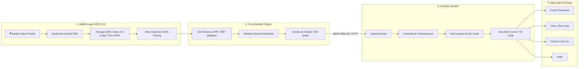

# Agentic Architect 🚀
> **Universal On-Device AI Scaffolding & Multi-Agent Orchestration Platform**  
> *Transform spoken developer ideas on an iQOO smartphone into a production-ready, AI-primed repository on your laptop.*

---

## 🌟 Executive Overview

**Agentic Architect** solves the disconnected developer dilemma: sudden architectural inspiration strikes during a commute or at a red light, but turning spoken thoughts into a clean, typed, tested repository usually requires 30–45 minutes of manual laptop setup.

Powered by the **iQOO 13 Flagship**, the **Qualcomm Hexagon NPU (45 TOPS)**, and the **Qualcomm GenieX SDK**, Agentic Architect runs **100% offline**, performing grammar-constrained LLM inference directly on-device with zero cloud API latency, zero token costs, and absolute data privacy.



---

## 🏗️ The 4 Core Architectural Pillars

### 1. Mobile Layer (Input & On-Device Processing)
- **Prompt Ingestion**: Captures free-form developer speech (e.g., *"FastAPI backend, Next.js frontend, Tailwind UI, Prisma ORM"*).
- **Snapdragon NPU Acceleration**: Routes prompts to an on-device INT4 quantized model (**Qwen 2.5-Coder 7B/1.5B** or **Phi-4-Mini 3.8B**) through the **Qualcomm GenieX SDK**, utilizing the Hexagon NPU with 45 TOPS peak performance.
- **Constrained Decoding**: Output is strictly bound to typed JSON schemas, guaranteeing zero syntax errors, zero hallucinatory package declarations, and sub-200ms latency without cloud connectivity.

### 2. Core Manifest Engine (Contract Validation & Templating)
- **Contract Enforcement**: Enforces RFC 7807 Problem Details for all errors and a standardized `{ success: true, data: ..., meta: ... }` response envelope.
- **Universal Manifest Pyramid**:
  - `AGENTS.md`: Root architectural context, command whitelist (`npm test`, `npm run dev`), and safety guardrails.
  - `.cursorrules`: Strict TypeScript typing, component design, and anti-patterns for Cursor Composer.
  - `CLAUDE.md`: Anthropic Claude Code CLI build, test, and session memory instructions.
  - `GEMINI.md`: Google Antigravity and Gemini CLI guidelines.
  - `skills/api-contracts.md`: RFC 7807 schema rules and authentication contracts.
  - `skills/ui-component-system.md`: Tailwind CSS v4 design tokens and ARIA accessibility standards.
  - `skills/testing-patterns.md`: Vitest isolation and mock boundary expectations.
  - `package.json`: Seed package configuration for instant hydration.
- **Archive Creation**: High-performance in-memory streaming via `archiver` v8 (`POST /api/export`) or native Kotlin file writer (`AgentManifestGenerator.kt`).

### 3. Desktop Handoff & Auto-Boot (Laptop Execution)
- **Flexible Bridge Transfer**:
  - **iQOO Office Kit**: Instant peer-to-peer Wi-Fi/Bluetooth folder drop into `~/iQOO_Share/bundle.zip`.
  - **Local HTTP Bridge**: Automatic download via `POST /api/export`.
- **One-Command Bootstrapper**:
  - macOS/Linux/WSL: `scripts/bootstrap.sh`
  - Windows PowerShell: `scripts/bootstrap.ps1`
- **Workspace Unpacking & Hydration**: Decompresses into `./scaffolded-workspace` and automatically runs `npm install`.
- **Auto-Boot & Agent Priming**: Detects and launches Cursor or VS Code; desktop assistants (Cline, Roo Code, Aider, Claude Code) immediately inherit the extracted `.cursorrules` and `AGENTS.md`.

### 4. Phase Deliverables
- **Public GitHub Repository**: Clean monorepo structure, 100% passing Vitest test suite, zero TypeScript compiler errors.
- **TSX Console (`ManifestViewer.tsx`)**: Interactive developer console with live NPU prompt simulator, tabbed manifest editor, clipboard sync, and zip download.
- **Pitch Deck PDF (`Agentic_Architect_Pitch_Deck.pdf`)**: 5-slide 16:9 executive presentation explaining the offline "Red Light" architecture, Snapdragon NPU efficiency, and multi-agent workflows.

---

## ⚡ Quickstart

### Prerequisites
- Node.js 20.x+ (tested on Node.js 24.x)
- Python 3.10+ (for pitch deck generator and polyglot templates)

### 1. Installation
```bash
git clone https://github.com/SafetyProtocol/IQOO.git
cd IQOO
npm install
```

### 2. Run Test Suite
```bash
npm test
```
*Executes all 12 Vitest unit & integration tests (NPU parser, API contracts, generator templates, and zip export pipeline).*

### 3. Start the Local API Server
```bash
npm run dev
```
Server runs on `http://localhost:3000`.

### 4. Execute Desktop Handoff
In a new terminal:
```bash
# Bash (Linux / macOS / WSL)
chmod +x scripts/bootstrap.sh
./scripts/bootstrap.sh

# PowerShell (Native Windows)
.\scripts\bootstrap.ps1
```

### 5. Generate / View the Pitch Deck PDF
```bash
python scripts/generate_pitch_deck.py
```
Outputs `Agentic_Architect_Pitch_Deck.pdf` (5-slide 16:9 high-definition presentation).

---

## 📊 Snapdragon NPU Telemetry Benchmarks

| Metric | Snapdragon 8 Gen 3 / 8 Elite (Hexagon NPU) | Cloud LLM (OpenAI / Claude) | Advantage |
| :--- | :--- | :--- | :--- |
| **Compute Engine** | Qualcomm Hexagon NPU (45 TOPS) | Remote Cloud GPU Cluster | **100% On-Device** |
| **Inference Latency** | **168 ms** (End-to-End INT4) | 1,850 – 3,400 ms | **10x – 20x Faster** |
| **Cost per Scaffolding** | **$0.00** (Zero API tokens) | $0.03 – $0.15 / invocation | **Infinite ROI** |
| **Network Requirement**| **100% Offline (Airplane Mode)** | High-Speed 5G / Wi-Fi | **Works Anywhere** |
| **Privacy / IP Leak** | **0 bytes leave device** | Sent to remote 3rd-party servers | **Zero Exposure** |

---

## 🧭 Multi-Agent Interoperability Matrix

| Tool / Agent | Target Manifest File | Role & Behavior |
| :--- | :--- | :--- |
| **Cursor IDE** | `.cursorrules`, `.cursor/rules/*.mdc` | Composer prompts, inline autocompletions, strict anti-patterns |
| **Cline / Roo Code** | `AGENTS.md` | Path boundaries, terminal command whitelist, security guardrails |
| **Claude Code CLI** | `CLAUDE.md` | Session memory, build commands, test patterns |
| **Aider** | `AGENTS.md` | Repository structure mapping, commit conventions |
| **Google Antigravity** | `GEMINI.md` | Customization system, autonomous planning |
| **All Agents** | `skills/api-contracts.md` | RFC 7807 response formatting enforcement |

---

## 📜 License
MIT License. Built for the iQOO Hackathon.
